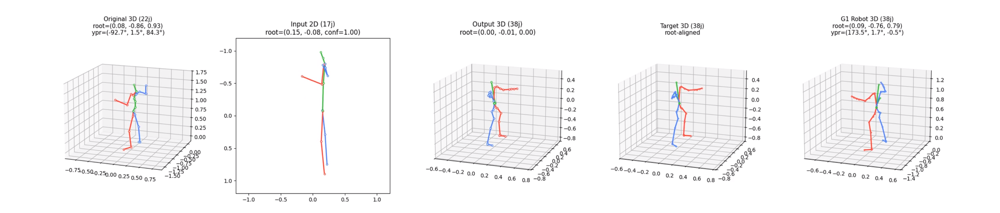

# Embed-Retarg

Compute embeddings and/or retargeted movement using MotionBERT backbone. Mostly based on : https://github.com/Walter0807/MotionBERT




## Install
```
# Install torch from you favorite source. For example
pip install torch==2.9.1 torchvision==0.24.1 torchaudio==2.9.1 --index-url https://download.pytorch.org/whl/cu128

# Install requirements
pip install -r requirements
```

TODO / Things may be misisng, so make sure everyhting is `requirements.txt`

## Get models

Download the models and put them in `checkpoints` (see the tree directory below) : XXX

## Overall behavior
1. Pretrained MotionBERT
The model was trained for reconstruction of 17 3D keypoints of the body from 17 2D keypoints of the body on H36M dataset (including with augmentation/masking strategies)

2. Trained Embed-Retarg Model
The model is fully finetuned from the pretrained MotionBERT the following way :
    - *Input* 22 3D keypoints human motion sequences are projected onto 2D (with a fake camera view) then converted to 17 keypoints to match the pretrained input
    - *Target* 38 3D G1 keypoints are either kept as it is (1 - `remap_joints_head: True`) or remapped to 17 3D keypoints (2 - `remap_joints_head: False`), root-relative
    - The pretrained-models gives embeddings of shape  `[T, 17, 512]` then there are either remapped with a learnable layer to `[T, 38, 512]`  (1) or kept as it is (2)
    - These embeddings are optionnaly passed through an added compression layer to give embeddings of shape `[T, J, 64]`, and then a 3D prediction head to produce a 3D *output* skeleton with either 38 (1) or 17 (2) keypoints, that is compared against the *target* 

Conversions are explicited in `tools/conversion_tool.py`

## Configuration file
The config files used for trainings are saved along with checkpoints to reproduce the right setup.
Noticeable configuration fields :
- `remap_joints_head: True` or `remap_joints_head: False` -> If enabled the model was trained to match the 38 G1 target joint from the 2D 17 keypoints input otherwise the model was trained to match a remapping of those joints into 17 G1 joints (see `g12h36m()`)
- `use_compression: True` or `use_compression: False` -> If enabled the model had the optionnal compression head, otherwise the 512 features are directly remapped to 3D (original MotionBERT behavior)
- `test_keywords: ["MartialArtsStances_c3d"]` or `test_keywords: []` -> How the `[train]`/`[test]` subset were defined, if any keywords are defined in `test_keywords` then all file path containing these keywords are used in the test set and excluded from the training set, otherwise all `random_shape_XXX.npz` files are used for training and `motion_shape.npz` files are used for testing (as inputs, in any case the *target* is the corresponding  `motion_shape_g1.npz`).  

## Inference
Data must be formatted following `accad_subset_random_shapes`

```
python infer_embeddings.py --config ./checkpoints/mb_retarg_compress_17/config.yaml -e ./checkpoints/mb_retarg_compress_17/latest_epoch.bin --subset sp_MartialArtsStances_1
```

It will save the embeddings produces in `results/[modelname]/inference_[YYYY_MM_DD_HH_MM_SS]/[MOTION_PATH]/[filename]000_embed.npz`
Each of them can be read with numpy and have shape : [1, T, J, D] with T = 17 or 38 depending on if the model comprises a retargeting to 38 or 17 joints and D = 64 or 512 depending if the model comprises a compression step or not

**Options**
- Pass `--save_video` to save an MP4 visualization of the movement after decoding the embeddings
- Pass `--save_pose3d` to save npz file with the 3D movement (target ground truth and predicted to visualized with vispy)
- Use `--subset XXX` to specify what you want to use for inference, if you pass `train` or `test` it will use the train or test set (as determined by the ocnfig file), if you pass `sp_KEYWORD_N` it will take the `N` first `motion_shape` files with `KEYWORD` in the path, if you pass `sp_all` it does inference for all files.

## Visualization
When used with --save_pose3d you may visualize embeddings

```
python ./tools/vis_vispy.py ./results/model_mb_retarg_compress_17/inference_2026_04_15_15_50_37/Male2MartialArtsStances_c3d/D11_-_ready_to_taunt_one_to_ready_stageii/motion_shape000_pose.npz
```

## Training

```
python train_embedretarg.py --config ./configs/pose3d/MB_ft_embedretarg_noremap_testmartialart.yaml
```

It will train from pretrained MotionBERT checkpoint with the specified config and save the model weights and a copy of the config in `./checkpoints/[YYYY_MM_DD_HH_MM_SS]`.

## Directory structure

```
.
├── checkpoints
│   ├── mb_retarg_compress_17
│   │   ├── config.yaml
│   │   └── latest_epoch.bin
│   ├── mb_retarg_nocompress_38
│   │   ├── best_epoch.bin
│   │   ├── config.yaml
│   │   ├── epoch_29.bin
│   │   ├── epoch_59.bin
│   │   └── latest_epoch.bin
│   ├── pose3d
│   │   ├── FT_MB_lite_MB_ft_h36m_global_lite
│   │   └── FT_MB_release_MB_ft_h36m
│   └── pretrain
│       └── latest_epoch.bin
├── configs
│   ├── pose3d
│   │   └── MB_ft_embedretarg.yaml
│   └── pretrain
│       ├── MB_lite.yaml
│       └── MB_pretrain.yaml
├── lib
├── README.md
├── requirements.txt
├── results
│   └── model_mb_retarg_nocompress_38           # All the results with model mb_retarg_nocompress_38
│       └── inference_2026_04_15_12_08_12       # One session of inference
├── tools
│   ├── conversion_tools.py
│   ├── rendering.py
│   └── vis_vispy.py                            # Visualization tool for 3D skeletons, needs vispy installed
├── infer_embeddings.py                         # Inference script
└── train_embedretarg.py                        # Training script
```